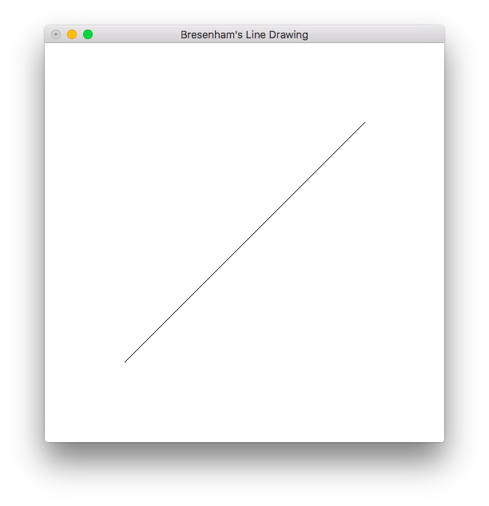
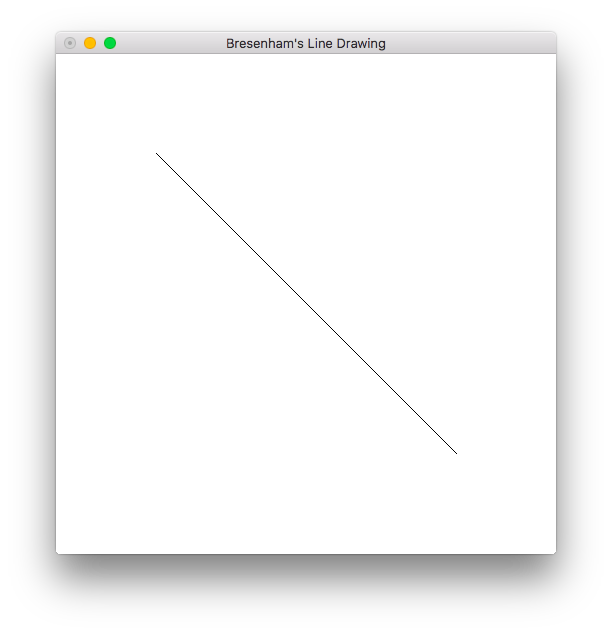
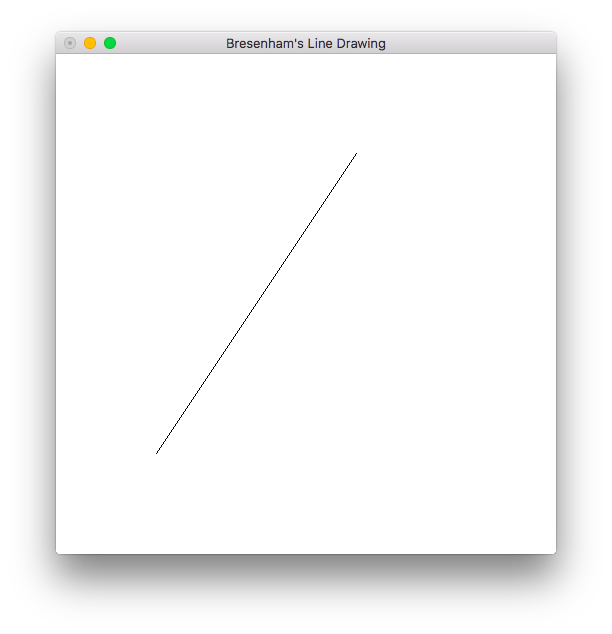
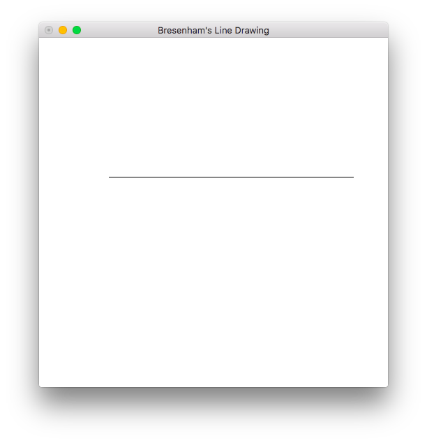
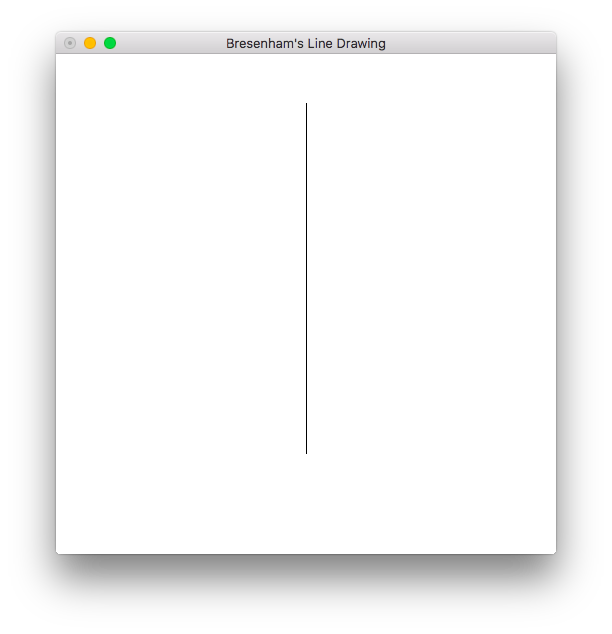

# Bresenham's Line Drawing
> Program to generate a line using **Bresenham's Line Drawing** technique. (Slopes greater than one and less than one)

### Compile

#### For Linux
```
$ ./compile linux
```

or
```
$ g++ bresenham_line.cpp -lGL -lGLU -lglut -o bresenham_line.o
```

#### For macOS
```
$ ./compile mac
```

or
```
g++ bresenham_line.cpp -framework OpenGL -framework GLUT -o bresenham_line.o
```

### Run
Window Size: `500x500`

#### Example 1 (slope = 1)
```
$ ./bresenham_line.o
Enter (x1, y1, x2, y2)
100 100 400 400
```



#### Example 2 (slope = -1)
```
$ ./bresenham_line.o
Enter (x1, y1), (x2, y2)
100 400 400 100
```



#### Example 3 (slope < 1)
```
$ ./bresenham_line.o
Enter (x1, y1), (x2, y2)
100 300 400 200
```


#### Example 4 (slope > 1)
```
$ ./bresenham_line.o
Enter (x1, y1), (x2, y2)
100 100 300 400
```



#### Example 5 (horizontal)
```
$ ./bresenham_line.o
Enter (x1, y1), (x2, y2)
100 300 450 300
```



#### Example 6 (vertical)
```
$ ./bresenham_line.o
Enter (x1, y1), (x2, y2)
250 450 250 100
```


