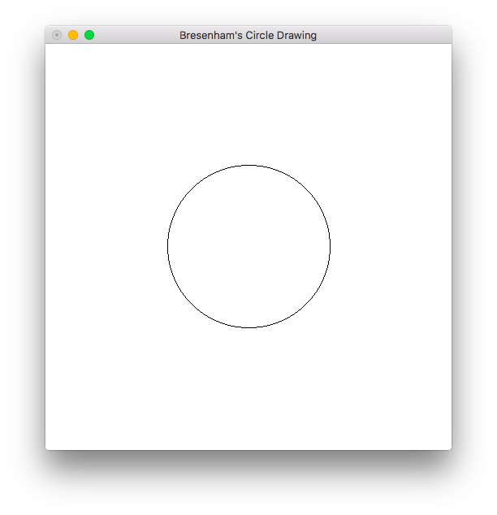

# Bresenham's Circle Drawing
> Program to generate a circle using Bresenham's Circle Drawing technique.

### Compile

#### For Linux
```
$ ./compile linux
```

or
```
$ g++ bresenham_circle.cpp -lGL -lGLU -lglut -o bresenham_circle.o
```

#### For macOS
```
$ ./compile mac
```

or
```
$ g++ bresenham_circle.cpp -framework OpenGL -framework GLUT -o bresenham_circle.o
```

### Run
Window Size: `500x500`

#### Example
`Center: (250, 250)` &  `Radius: 100`

```
$ ./bresenham_circle.o
Enter Circle Center (x1, y1) and radius (r)
250 250 100
```


